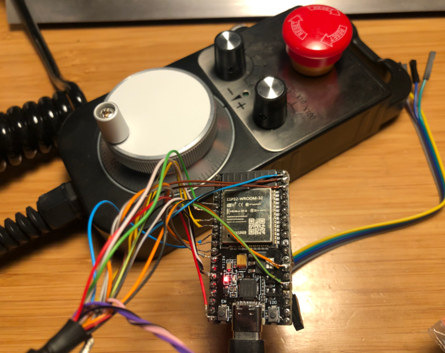

# ESP32 MPG Pendant for grblHAL

This is custom firmware for an ESP32-based manual pulse generator (MPG) pendant designed to communicate with a grblHAL CNC controller using the binary MPG protocol. It supports encoder-based jogging, axis and multiplier selection, and an E-stop input.

It was written to allow usage of the relatively common MPG pendants with grblHAL. This was the one used for testing: https://www.amazon.com/dp/B07CZ7F3Y3/



## Features

- Quadrature encoder input using ESP32 PCNT hardware
- Axis and multiplier selectors
- E-stop handling with debounce
- 3.3V serial output to grblHAL (UART1)
- LED feedback for mode and E-stop status

---

## 🧰 Setup in VSCode with PlatformIO

1. **Install PlatformIO**
   - Open VSCode
   - Go to Extensions and install the [PlatformIO IDE](https://platformio.org/install/ide?install=vscode)

2. **Clone or copy this project**
   ```bash
   git clone https://github.com/JamesHagerman/esp32-mpg-pendant-for-grblhal.git
   cd esp32-mpg-pendant-for-grblhal
   ```

3. **Open in VSCode**
   - Open the folder using `File > Open Folder` in VSCode
   - PlatformIO will auto-detect the project

4. **Build and Upload**
   - Connect your ESP32 board via USB
   - Click the **"PlatformIO: Upload"** button (checkmark icon in the bottom bar)
   - Or run:
     ```bash
     pio run --target upload
     ```

---

## ⚡ Wiring Diagram

*NOTE: Unverified! Wiring should be straight forward, but be careful here. Hound me to get back to this...*

| Signal        | ESP32 GPIO | Description                         |
|---------------|------------|-------------------------------------|
| 5v from grblHAL | 5v | Power ESP32 from grblHAL board            |
| Encoder 5v    | 5v         | Power for encoder                   |
| Encoder Gnd   | GND        | Power for encoder                   |
| Encoder A     | 34         | Encoder pulse input (PCNT)          |
| Encoder B     | 35         | Encoder direction input (PCNT)      |
| E-stop        | 25         | E-stop switch input (active HIGH)   |
| Mult X1       | 14         | Jog multiplier: x1                  |
| Mult X10      | 27         | Jog multiplier: x10                 |
| Mult X100     | 26         | Jog multiplier: x100                |
| Axis X        | 33         | Select X axis                       |
| Axis Y        | 32         | Select Y axis                       |
| Axis Z        | 23         | Select Z axis                       |
| Axis A        | 22         | Select A axis                       |
| TX to grblHAL | 17         | TX1: Serial out to grblHAL RX       |
| LED           | 2          | Status LED                          |
| COMMON        | 4          | Tie to GND or act as sink           |
| RX from grblHAL (optional) | 16 | RX1: Serial in (not used)       |


**Note:** All switches should be momentary or maintained contact to GND (via COMMON). Inputs are pulled up internally.

---

## ✅ Notes

- Serial communication is 115200 baud, 8N1.
- Firmware uses grblHAL's binary MPG protocol.
- E-stop is triggered when GPIO 25 goes **HIGH** (switch opens).
- Make sure your grblHAL build supports real-time MPG toggle commands!
    - More notes on this comming soon. TL;DR: In grblHAL Web Builder, `MPG & DRO mode:` should be set to `Real time command switchover`. Unclear if `Keypad` must also be configured. Testing in progress.
